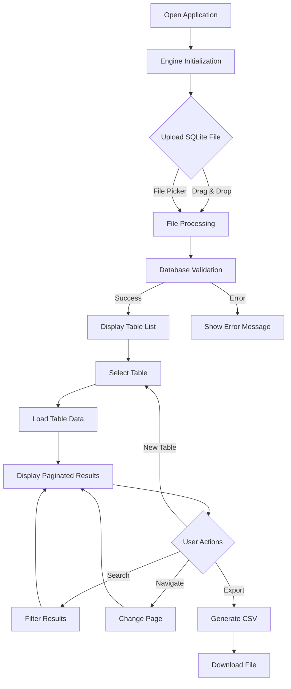
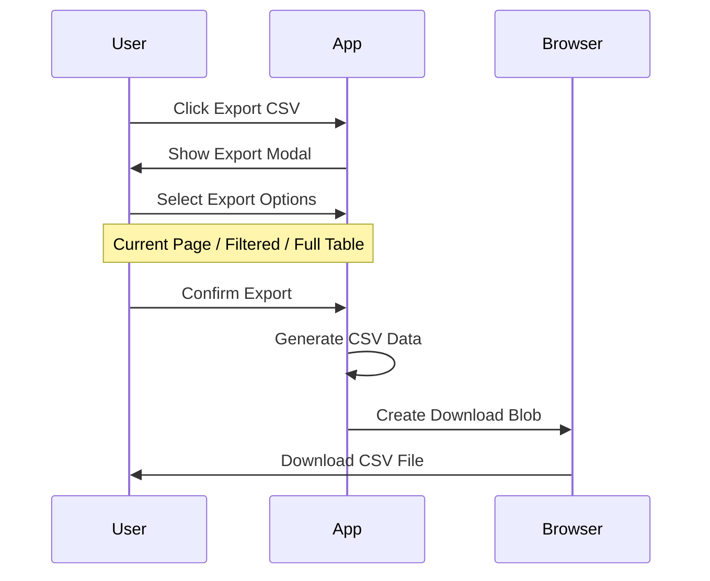

# xsukax SQLite Database Viewer

[](https://www.gnu.org/licenses/gpl-3.0)
[](https://caniuse.com/wasm)
[](https://github.com)

A professional, privacy-focused SQLite database viewer that runs entirely in your browser. View, search, and export SQLite database tables without uploading your data to any server.

## Project Overview

**xsukax SQLite Database Viewer** is a client-side web application designed for developers, data analysts, and database administrators who need to quickly inspect SQLite database files without installing desktop software or compromising data privacy. Built with modern web technologies and WebAssembly, it provides a seamless, secure environment for database exploration.

### Primary Functionalities

- **Client-Side Database Processing**: Utilizes sql.js (SQLite compiled to WebAssembly) for complete browser-based operation
- **Interactive Table Browsing**: Navigate through database tables with intuitive pagination and search capabilities  
- **Professional Data Export**: Generate CSV files with configurable options for different export scenarios
- **Memory-Efficient Architecture**: Handles large databases through intelligent pagination and resource management
- **Cross-Platform Compatibility**: Works on any modern web browser across desktop and mobile devices

## Security and Privacy Benefits

### 🔒 Complete Data Privacy
- **Zero Server Communication**: All database processing occurs locally in your browser - no data ever leaves your device
- **No Cloud Dependencies**: Unlike online database tools, your sensitive data never touches external servers
- **Local File Processing**: Database files are read directly from your device's file system without uploading

### 🛡️ Enhanced Security Features
- **Client-Side Only Architecture**: Eliminates server-side vulnerabilities and data breach risks
- **No Data Persistence**: Application doesn't store or cache your database content
- **Memory Management**: Implements proper cleanup routines to prevent data leakage in browser memory
- **Multi-CDN Fallback**: Uses reputable CDN sources with integrity checking for external dependencies

### 🔐 Trust and Transparency
- **Open Source**: Full source code available for security auditing and verification
- **No Tracking**: Zero analytics, cookies, or user tracking mechanisms
- **Offline Capable**: Can be downloaded and run completely offline for maximum security
- **Transparent Dependencies**: Minimal external dependencies limited to the sql.js WebAssembly library

## Features and Advantages

### 🚀 Performance Optimizations
- **Lazy Loading**: Only loads visible data, enabling smooth performance with large datasets
- **Efficient Pagination**: Configurable page sizes (50-500 rows) for optimal memory usage
- **Debounced Search**: Intelligent search implementation prevents excessive database queries
- **Optimized Rendering**: Minimal DOM manipulation for fast table rendering

### 💡 User Experience Excellence
- **Apple-Inspired Design**: Clean, modern interface with glassmorphism effects and smooth animations
- **Mobile-First Responsive**: Fully optimized for tablets and smartphones
- **Drag & Drop Support**: Intuitive file upload with visual feedback
- **Real-Time Search**: Instant filtering across all table columns
- **Professional Data Display**: Proper handling of NULL values, BLOBs, and various data types

### 📊 Advanced Export Capabilities
- **Flexible CSV Export**: Choose from current page, filtered results, or complete table export
- **Excel Compatibility**: UTF-8 BOM encoding ensures proper display in Microsoft Excel
- **BLOB Handling**: Intelligent conversion of binary data for export purposes
- **Header Options**: Configurable column headers in exported files

### 🔧 Developer-Friendly Features
- **Database Integrity Checking**: Automatic validation of SQLite file integrity
- **Error Handling**: Comprehensive error reporting with helpful user messages
- **Performance Monitoring**: Built-in render time tracking for optimization insights
- **Multi-Format Support**: Compatible with .db, .sqlite, .sqlite3, and other SQLite variants

## Installation Instructions

### Method 1: Direct Download (Recommended)
1. Download the `index.html` file from this repository
2. Save it to your preferred location on your computer
3. Double-click the file to open it in your default web browser
4. Begin using immediately - no additional setup required

### Method 2: Clone Repository
```bash
git clone https://github.com/xsukax/xsukax-SQLite-Database-Viewer.git
cd xsukax-SQLite-Database-Viewer
# Open index.html in your browser
```

### Method 3: Web Server Deployment
For organizations wanting to deploy on internal networks:

```bash
# Using Python's built-in server
python -m http.server 8000

# Using Node.js http-server
npx http-server

# Using any web server of choice
```

### System Requirements
- **Browser**: Modern web browser with WebAssembly support
  - Chrome 57+
  - Firefox 52+  
  - Safari 11+
  - Edge 16+
- **Storage**: Minimal disk space (single HTML file ~50KB)
- **Memory**: Depends on database size; 4GB RAM recommended for large databases

## Usage Guide

### Basic Workflow



### Step-by-Step Instructions

#### 1. Loading a Database
1. **Launch Application**: Open the HTML file in your web browser
2. **Wait for Initialization**: The status badge will show "Engine ready" when WebAssembly loads
3. **Upload Database**: 
   - **Drag & Drop**: Drag your .sqlite file onto the upload area
   - **File Picker**: Click the upload area and select your database file
4. **Verification**: Application will validate file integrity and display database information

#### 2. Exploring Tables
1. **Select Table**: Choose a table from the dropdown menu
2. **View Data**: Table contents will display with automatic pagination
3. **Navigate**: Use pagination controls to browse through large datasets
4. **Search**: Enter terms in the search box to filter across all columns

#### 3. Data Export Process



#### 4. Advanced Features

**Search Functionality**
- Searches across all visible columns simultaneously
- Supports partial matches and case-insensitive filtering
- Results update automatically with debounced input

**Memory Management**
- Application automatically manages memory for large databases
- Pagination prevents browser memory overflow
- Proper cleanup when switching between tables

**Mobile Usage**
- Touch-friendly interface optimized for tablets and phones
- Responsive table display with horizontal scrolling
- Optimized controls for touch interaction

### Troubleshooting

| Issue | Solution |
|-------|----------|
| Engine won't initialize | Check internet connection; application needs to download WebAssembly |
| File won't load | Verify file is valid SQLite format; check file permissions |
| Tables appear empty | Database may need WAL checkpoint; try exporting from source application |
| Export fails | Check browser's download permissions and available disk space |
| Slow performance | Reduce page size for large tables; close other browser tabs |

## Browser Compatibility

| Browser | Version | Status | Notes |
|---------|---------|--------|-------|
| Chrome | 57+ | ✅ Full Support | Recommended browser |
| Firefox | 52+ | ✅ Full Support | Excellent performance |
| Safari | 11+ | ✅ Full Support | iOS Safari supported |
| Edge | 16+ | ✅ Full Support | Chromium-based preferred |
| Internet Explorer | Any | ❌ Not Supported | WebAssembly required |

## Contributing

We welcome contributions from the community! Please read our contributing guidelines:

1. **Fork the Repository**: Create your own fork of the project
2. **Create Feature Branch**: `git checkout -b feature/amazing-feature`
3. **Commit Changes**: `git commit -m 'Add amazing feature'`
4. **Push to Branch**: `git push origin feature/amazing-feature`
5. **Open Pull Request**: Submit a pull request with detailed description

### Development Guidelines
- Maintain single-file architecture for simplicity
- Follow existing code style and formatting
- Test across multiple browsers before submitting
- Update documentation for new features
- Ensure accessibility compliance

## Licensing Information

This project is licensed under the **GNU General Public License v3.0** (GPL-3.0).

### What this means:
- ✅ **Commercial Use**: You can use this software for commercial purposes
- ✅ **Modification**: You can modify the source code
- ✅ **Distribution**: You can distribute the software
- ✅ **Patent Use**: You can use any patents contributed to this project
- ✅ **Private Use**: You can use this software privately

### Requirements:
- 📋 **License and Copyright Notice**: Include original license and copyright
- 📋 **State Changes**: Document any changes made to the source code  
- 📋 **Disclose Source**: Make source code available when distributing
- 📋 **Same License**: Distribute under the same GPL-3.0 license

### Full License
The complete license text is available in the [LICENSE](LICENSE) file in this repository, or at [https://www.gnu.org/licenses/gpl-3.0.html](https://www.gnu.org/licenses/gpl-3.0.html).

---

**Made with ❤️ for the open-source community**
